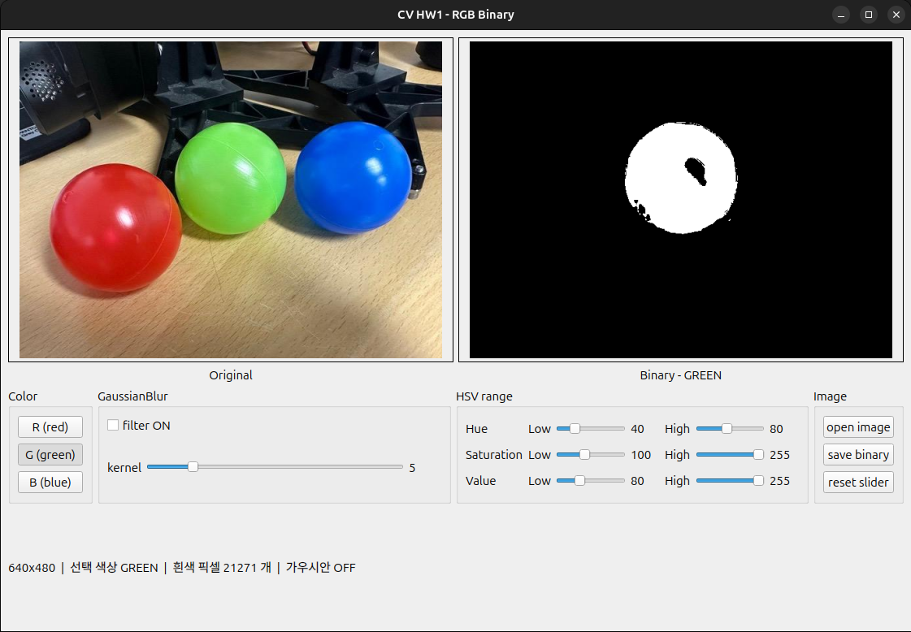
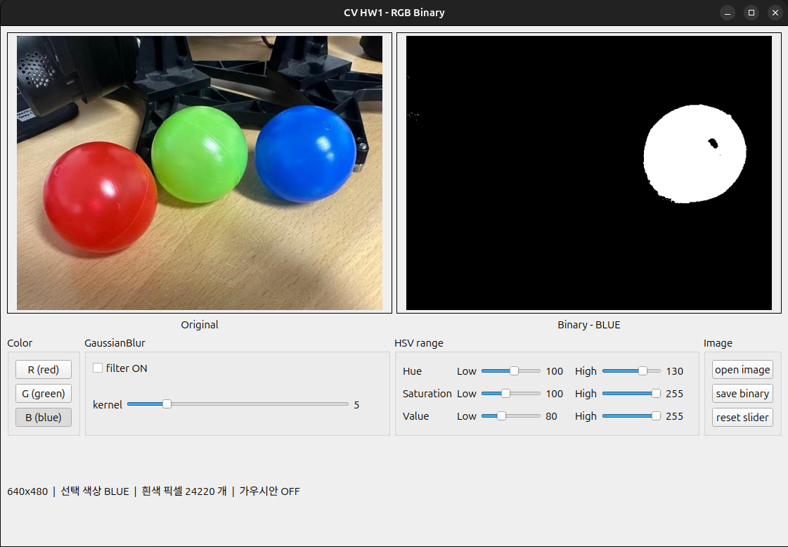
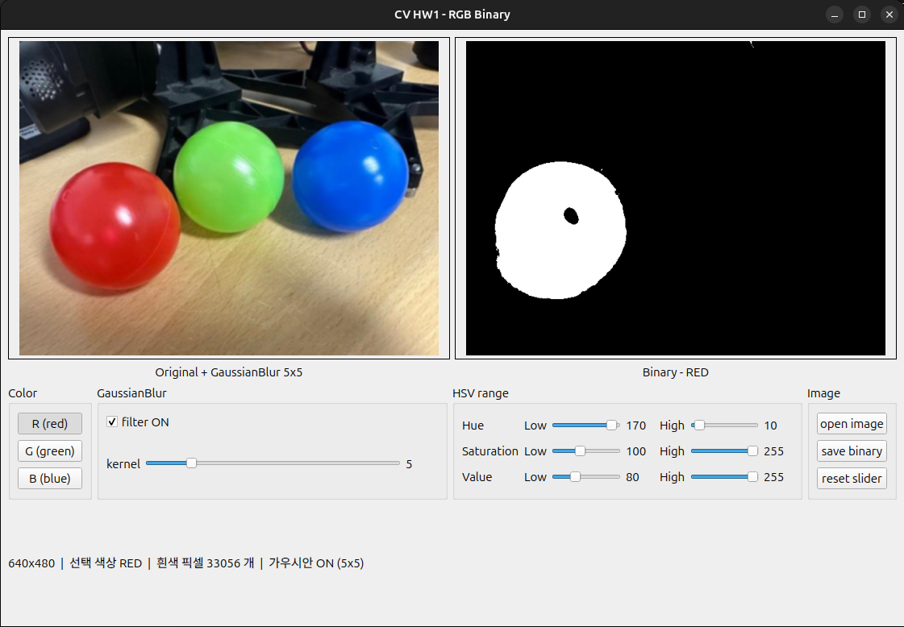
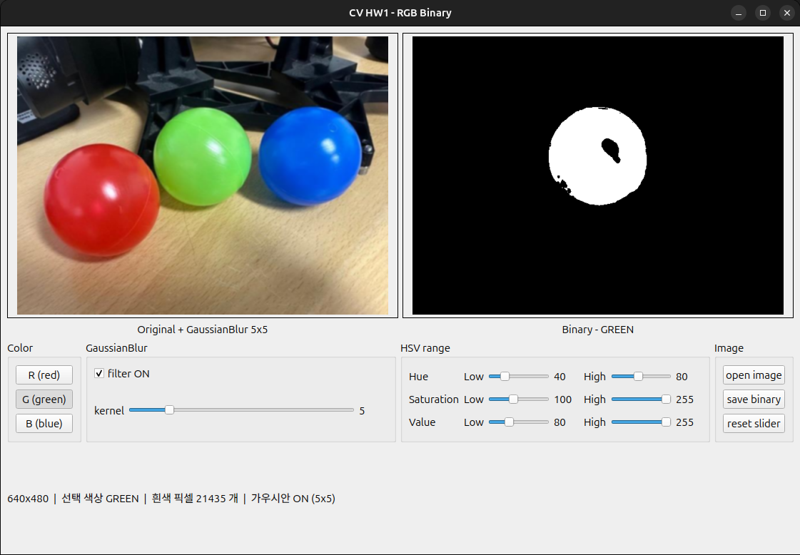
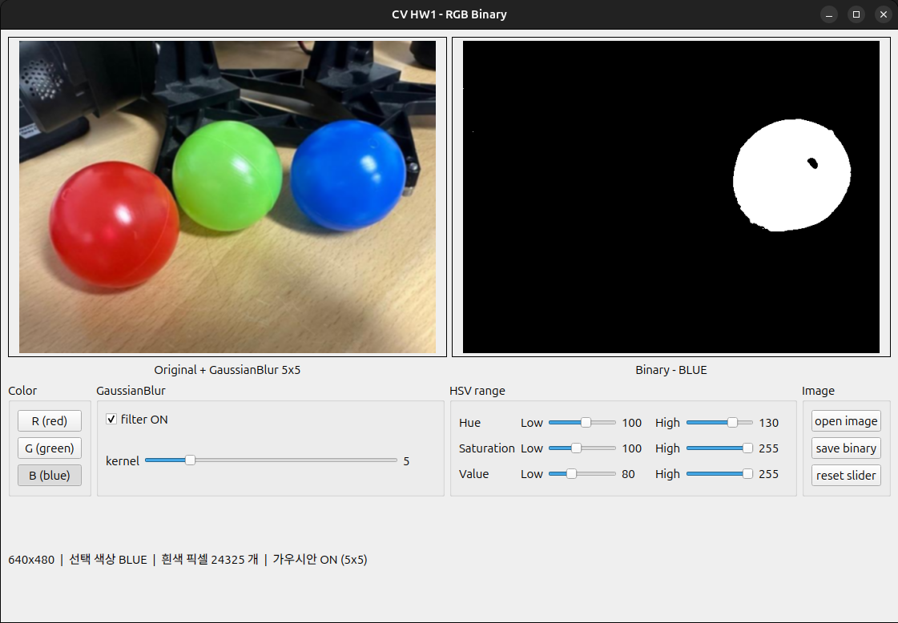

# HW_1

이규환 2026406017

1. 공 사진을 HSV로 바꾼 뒤 빨간공, 초록공, 파란공을 `inRange`로 각각 이진화한다
2. Qt GUI에서 왼쪽에 원본, 오른쪽에 바이너리를 띄우고 R / G / B 버튼으로 색을 고른다
3. 가우시안 필터를 적용해 같은 작업을 하고, 적용 전후로 무엇이 달라지는지와 왜 가우시안 필터를 쓰는지 분석한다

패키지 이름은 `cv_hw1`, 실행은 `ros2 run cv_hw1 cv_hw1`이다.

---

## 1. 과제에 사용한 개념

픽셀, 색 표현 방식, 모폴로지 같은 OpenCV 전반의 개념 정리는 HW2 보고서에 모아서 적었다. 여기서는 이번 과제를 설명하는 데 필요한 세 가지만 짚고 넘어간다.

**HSV** — 색을 H(색조), S(채도), V(명도) 세 가지로 표현하는 방식이다. RGB는 조명이 밝아지면 세 채널이 전부 같이 올라가서 "무슨 색인가"와 "얼마나 밝은가"가 뒤섞여 있다. HSV는 이 둘이 채널로 분리돼 있어서, **H로 색 계열을 고르고 S와 V로 너무 흐리거나 어두운 것을 걸러내는** 방식이 가능하다. 색 추출을 해야 하는 이번 과제에는 HSV가 맞다. H는 0~179, S와 V는 0~255 범위다.

**inRange** — 각 픽셀의 세 채널이 지정한 하한~상한 사이에 있으면 255, 하나라도 벗어나면 0을 넣어 바이너리 이미지를 만든다.

```cpp
Mat img_hsv;
cvtColor(img, img_hsv, COLOR_BGR2HSV);

Scalar lower = Scalar(h_low, s_low, v_low);
Scalar upper = Scalar(h_high, s_high, v_high);
inRange(img_hsv, lower, upper, mask);
```

여기서 중요한 건 **세 조건이 AND로 묶인다**는 점이다. H가 아무리 정확해도 S가 하한보다 낮으면 그 픽셀은 버려진다. 슬라이더를 만지다 보면 "H는 맞췄는데 화면이 전부 까맣다"는 상황이 자주 생기는데, 범인은 거의 항상 S나 V의 하한이었다.

**GaussianBlur** — 픽셀을 주변 값과 섞어서 주변과 극단적으로 다른 값(노이즈)을 눌러주는 필터다. 가운데에 가중치를 크게 주고 멀어질수록 작게 준다.

```cpp
GaussianBlur(src, dst, Size(ksize, ksize), 0);
```

`ksize`는 반드시 홀수여야 한다. 중심 픽셀이 있어야 "가운데에 가중치를 크게 준다"는 말이 성립하기 때문이다. 그래서 GUI에서도 슬라이더 값을 그대로 쓰지 않고 `value * 2 + 1`로 바꿔 항상 홀수가 나오게 만들었다.

---

## 2. 구현

### 2-1. 처리 순서

```
원본 → (GaussianBlur) → cvtColor(BGR2HSV) → inRange → 바이너리
```

한 줄이면 끝나는 흐름인데, 이 순서를 정하는 데서 실제로 고민을 좀 했다. (2-4에 적었다.)

### 2-2. GUI 구성

| 위젯 | 역할 |
|---|---|
| QLabel 2개 | 왼쪽 원본, 오른쪽 바이너리 |
| QPushButton 3개 (R / G / B) | 추출할 색 선택 |
| QCheckBox + QSlider | 가우시안 ON/OFF, 커널 크기 |
| QSlider 6개 | H·S·V의 하한·상한 직접 조절 |
| QPushButton 3개 | 이미지 열기, 바이너리 저장, 슬라이더 초기화 |

색 버튼을 누르면 그 색의 HSV 기본값이 슬라이더에 자동으로 들어가고, 거기서 슬라이더로 미세 조정하는 방식으로 만들었다. 처음엔 버튼만 만들려고 했는데, 값을 눈으로 보면서 움직여봐야 각 채널이 무슨 역할을 하는지 감이 잡힐 것 같아서 슬라이더를 추가했다. 실제로 S 하한을 0까지 내려보면 책상 전체가 흰색으로 변해서 "아, S가 이런 역할이구나" 하고 바로 이해가 됐다.

화면 아래 상태줄에는 현재 흰색 픽셀 개수를 띄우게 했다. 4장의 분석은 전부 이 숫자를 보면서 했다.

### 2-3. 막혔던 부분 1 — 빨간색의 Hue 경계

초록과 파랑은 H 구간이 하나로 이어져 있어서 `inRange` 한 번이면 끝난다. 그런데 빨강을 하려니까 화면이 반쯤만 잡혔다.

원인은 **빨강이 색상환에서 0도 지점에 있다**는 것이었다. H가 0~179의 원형 값이라 빨강은 179 쪽 끝과 0 쪽 끝에 **양쪽으로 갈라져서** 걸쳐 있다. `inRange(0, 10)`으로 하면 170~179쪽 절반을 놓치고, `inRange(170, 179)`로 하면 반대쪽 절반을 놓친다.

| 색 | Hue 구간 | inRange 호출 |
|---|---|---|
| RED | 170 ~ 179, 0 ~ 10 | 2회 + OR |
| GREEN | 40 ~ 80 | 1회 |
| BLUE | 100 ~ 130 | 1회 |

그래서 **하한이 상한보다 큰 경우를 "0을 넘어가는 구간"으로 해석**해서 `inRange`를 두 번 부르고 결과를 OR로 합치게 만들었다. 이렇게 해두니 슬라이더로 H Low를 170, H High를 10으로 놔도 자연스럽게 동작한다.

```cpp
if (h_low <= h_high)
{
  inRange(hsv, Scalar(h_low, s_low, v_low), Scalar(h_high, s_high, v_high), mask);
}
else
{
  inRange(hsv, Scalar(0, s_low, v_low), Scalar(h_high, s_high, v_high), mask_low);
  inRange(hsv, Scalar(h_low, s_low, v_low), Scalar(179, s_high, v_high), mask_high);
  mask = mask_low | mask_high;
}
```

`cv::Mat`끼리 `|` 연산자로 OR가 된다는 것도 이때 알게 됐다. 두 바이너리 이미지를 겹치는 거라 둘 중 하나라도 255면 255가 된다.

### 2-4. 막혔던 부분 2 — 가우시안을 어디에 넣을 것인가

처음에는 HSV로 바꾼 다음에 블러를 거는 게 맞다고 생각했다. 어차피 inRange 직전이니까 상관없을 줄 알았다. 그런데 그렇게 해보니 결과가 이상하게 나왔다.

이유를 생각해보니 **Hue가 원형 값이기 때문**이었다. H 채널에서 빨강은 0이면서 동시에 179다. 블러는 주변 값의 평균을 내는 연산인데, 0과 179를 평균 내면 약 90이 나온다. 90은 청록색이다. 빨간 영역의 경계에서 난데없이 청록색 픽셀이 만들어지는 셈이다.

그래서 **가우시안은 반드시 cvtColor 앞, BGR 상태에서** 걸어야 한다. BGR 채널은 각각 0~255의 단순한 세기 값이라 평균을 내도 의미가 깨지지 않는다. 직접 순서를 바꿔보면서 알게 된 부분이라 오래 기억에 남을 것 같다.

### 2-5. 막혔던 부분 3 — cv::Mat을 Qt에 띄우기

OpenCV와 Qt는 이미지 자료형이 달라서 `cv::Mat`을 `QImage`로 바꿔야 QLabel에 띄울 수 있다. 여기서 세 번 막혔다.

**첫째, 채널 순서.** OpenCV는 BGR인데 Qt의 기본 포맷은 RGB다. 그냥 넘겼더니 빨간공이 파랗게 나왔다. `QImage::Format_BGR888`을 쓰니 해결됐다.

**둘째, step.** QImage 생성자의 네 번째 인자는 "한 줄이 몇 바이트인가"다. 이걸 `cols * 3`으로 계산해서 넣었더니 화면이 비스듬히 밀려서 나왔다. `cv::Mat`은 메모리 정렬 때문에 실제 한 줄 길이가 `cols * 3`보다 클 수 있어서, 반드시 `image.step`을 넣어야 한다.

**셋째, 메모리 공유.** `QImage(image.data, ...)`는 Mat의 메모리를 **복사하지 않고 가리키기만 한다.** Mat이 사라지면 QImage는 없어진 메모리를 가리키게 된다. 처음엔 멀쩡히 돌다가 가끔 이상한 화면이 뜨거나 프로그램이 죽어서 제일 찾기 어려웠다. `.copy()`를 한 번 끼워 넣어 해결했다.

```cpp
if (image.channels() == 1)
  qimage = QImage(image.data, image.cols, image.rows, image.step, QImage::Format_Grayscale8);
else
  qimage = QImage(image.data, image.cols, image.rows, image.step, QImage::Format_BGR888);

label->setPixmap(QPixmap::fromImage(qimage.copy()).scaled(VIEW_W, VIEW_H, Qt::KeepAspectRatio));
```

바이너리 이미지는 채널이 하나라 `Format_Grayscale8`로 따로 처리해야 한다는 것도 같이 알게 됐다.

### 2-6. HSV 기본값을 정한 방법

값을 감으로 찍지 않고, 각 공의 중심 부근 픽셀값을 실제로 확인해서 정했다.

| 색 | H | S | V |
|---|---|---|---|
| RED | 170 ~ 10 | 100 ~ 255 | 80 ~ 255 |
| GREEN | 40 ~ 80 | 100 ~ 255 | 80 ~ 255 |
| BLUE | 100 ~ 130 | 100 ~ 255 | 80 ~ 255 |

세 색 모두 S 하한을 100, V 하한을 80으로 똑같이 뒀다. 사진에서 걸러내야 할 게 두 가지인데,

- **책상** — 연한 나무색이라 채도가 낮다 (S가 60~90 정도) → S 하한 100으로 컷
- **검은 구조물** — 명도가 낮다 (V가 80 이하) → V 하한 80으로 컷

이렇게 S와 V 하한 두 개로 배경이 거의 다 정리되고, 나머지는 H가 색을 갈라준다. 세 색이 S·V를 공유할 수 있다는 게 HSV를 쓰는 이점이라는 생각이 들었다.

---

## 3. 실행 결과

### 3-1. 가우시안 필터 OFF






세 색 모두 해당하는 공만 흰색으로 남았고 나머지 두 공, 책상, 검은 구조물은 전부 걸러졌다. HSV 범위만으로 이 정도가 나오는 게 신기했다.

다만 자세히 보면 두 가지 문제가 보인다.

**공 표면의 반사광이 검은 구멍으로 남았다.** 조명이 반사된 부분은 흰빛에 가까워서 채도가 S 하한 아래로 떨어지기 때문이다. 초록공이 특히 심해서 구멍이 길쭉하게 뚫려 있다.

**배경 곳곳에 작은 흰 점이 흩어져 있다.** RED에서는 오른쪽 위에, GREEN에서는 공 왼쪽 아래에, BLUE에서는 왼쪽 영역에 점들이 보인다. 이게 노이즈고, 4장에서 분석할 대상이다.

### 3-2. 가우시안 필터 ON (5 × 5)







왼쪽 원본 화면이 눈에 띄게 뿌예졌고, 오른쪽 바이너리에서 **작은 흰 점들이 대부분 사라졌다.** 특히 GREEN과 BLUE는 배경이 거의 완전히 까맣게 정리됐다. 공의 테두리도 톱니 모양이 줄어서 매끈해진 게 보인다. 반면 **반사광 구멍은 거의 그대로**다.

### 3-3. 실행 영상

전체 실행 영상은 같은 폴더에 `cv_hw1.mp4`으로 첨부했다. R → G → B 순서로 버튼을 눌러 색을 바꾸고, 가우시안을 켠 뒤 커널 크기를 3에서 15까지 올리면서 바이너리가 어떻게 변하는지 담았다.

---

## 4. 가우시안 필터 적용 전후 분석

### 4-1. 측정 결과

**흰색 덩어리 개수 (공 1개 + 노이즈 점들)**

| 커널 | RED | GREEN | BLUE |
|---|---|---|---|
| OFF | 9 | 17 | 15 |
| **5 × 5** | **6** | **4** | **4** |
| 9 × 9 | 4 | 2 | 1 |
| 15 × 15 | 2 | 2 | 1 |

**전체 흰색 픽셀 개수**

| 커널 | RED | GREEN | BLUE |
|---|---|---|---|
| OFF | 32,996 | 21,271 | 24,220 |
| **5 × 5** | **33,056** | **21,435** | **24,325** |
| 9 × 9 | 33,187 | 21,518 | 24,440 |
| 15 × 15 | 33,361 | 21,604 | 24,663 |

> 흰색 픽셀 개수는 프로그램 화면에 표시되는 값이고, 덩어리 개수는 `save binary`로 저장한 PNG를 따로 분석해서 센 값이다.

### 4-2. 무엇이 달라졌는가

**① 작은 노이즈 점이 사라졌다**

가장 크게 바뀐 부분이다. 초록공은 덩어리가 17개에서 4개로, 파란공은 15개에서 4개로 줄었다. 노이즈 점은 주변 픽셀 몇 개가 우연히 색 범위에 들어간 것뿐이라 크기가 몇 픽셀밖에 안 되는데, 블러를 거치면 주변 배경 값과 섞이면서 범위 밖으로 밀려난다. **주변과 다를수록 많이 깎이는데 노이즈는 정의상 주변과 다른 값**이라 딱 노이즈만 골라서 지워지는 셈이다. 반대로 공은 가운데 픽셀의 주변도 전부 같은 색이라 평균을 내도 거의 변하지 않는다.

**② 공의 윤곽선이 매끄러워졌다**

저장한 바이너리에서 공 덩어리의 둘레를 재보니 RED 738.8 → 722.1, GREEN 647.4 → 639.2로 줄었다. 면적은 오히려 늘었는데 둘레만 짧아졌다는 건 경계선의 들쭉날쭉한 계단 모양이 펴졌다는 뜻이다. 필터를 안 걸면 경계에서 픽셀 단위로 색이 급격히 바뀌어서, 어떤 픽셀은 범위 안이고 바로 옆은 범위 밖이 되며 톱니가 생긴다.

**③ 전체 흰색 픽셀 수는 오히려 조금 늘었다**

이게 제일 예상 밖이었다. 노이즈가 줄었으니 픽셀 수도 줄 거라 생각했는데 세 색 모두 60~164픽셀씩 늘어났다. 초록공을 기준으로 뜯어보면, 노이즈가 사라지며 **56픽셀이 줄고** 경계가 완만해지며 원래 아슬아슬하게 범위 밖이던 픽셀들이 들어와 **220픽셀이 늘어서** 순증 164픽셀이 된다. 공 둘레가 600픽셀이 넘으니 경계선을 따라 한 겹만 들어와도 노이즈 전체보다 훨씬 크다.

숫자 하나만 보고 판단하면 안 된다는 걸 배운 부분이다. 흰색 픽셀 수만 보면 "가우시안이 오히려 나쁘다"고 결론 낼 뻔했는데, 덩어리 개수를 같이 보니 정반대였다.

**④ 반사광 구멍은 그대로 남았다**

구멍 크기는 커널을 15×15까지 키워도 거의 변하지 않았다 (초록공 839 → 831픽셀). 반사광은 몇 픽셀짜리 노이즈가 아니라 **수백 픽셀 크기의 실제로 하얀 영역**이라 주변과 섞어봐야 여전히 하얗기 때문이다. 이건 필터가 아니라 S 하한을 낮추거나 모폴로지 닫기 연산으로 메워야 하는 문제다.

### 4-3. 그래서 왜 가우시안 필터를 쓰는가

이진화는 **연속적인 값에 선을 하나 긋고 넘냐 못 넘냐로 자르는 연산**이라 경계 근처의 작은 흔들림에 아주 민감하다. 하한 근처에서 오르락내리락하는 픽셀은 원본의 미세한 차이만으로 결과가 0과 255로 완전히 갈린다. 가우시안 필터는 이진화 전에 이 흔들림을 미리 줄여주는 역할을 한다.

1. **노이즈 제거** — 잘못 잡힌 몇 픽셀짜리 점이 이진화 전에 걸러진다. 이걸 두면 다음 단계가 망가진다. 물체의 바운딩박스를 구할 때 구석에 점 하나만 남아도 박스가 화면 전체로 커진다.
2. **경계 안정화** — 윤곽선이 매끄러워져 물체 모양이 실제에 가까워진다.
3. **결과의 일관성** — 같은 장면도 센서 노이즈 때문에 프레임마다 결과가 미세하게 달라지는데, 필터를 거치면 그 차이가 줄어 실시간에서 결과가 덜 떨린다.

### 4-4. 커널 크기는 클수록 좋은가

표를 보면 커널을 키울수록 덩어리 개수가 계속 줄어들지만 대가가 두 가지 있다.

**물체가 번진다.** 15×15에서는 흰색 픽셀이 OFF 대비 RED 기준 365픽셀 늘었다. 경계가 실제보다 바깥으로 밀린 것이다. 작은 물체를 찾을 때는 물체 자체가 배경에 섞여 사라질 수도 있다.

**연산 시간이 늘어난다.** 640 × 480에서 블러 한 번에 3×3은 0.18ms, 9×9는 0.63ms, 31×31은 2.93ms가 걸렸다. 한 장만 보면 차이가 없어 보이지만 30fps 실시간에서는 매 프레임 드는 비용이다.

이번 사진에서는 **5×5에서 이미 노이즈가 대부분 사라졌고 번짐도 크지 않아** 5×5가 가장 무난했다. 커널 크기는 노이즈 제거 효과와 번짐·연산 시간 사이의 절충이고, 장면마다 적당한 값이 다르다는 게 결론이다.

---

## 5. 정리하며

- `inRange`의 세 조건은 AND로 묶이므로, 색이 안 잡힐 때는 H보다 S·V의 하한을 먼저 의심해야 한다.
- 빨강처럼 Hue가 0을 넘어가는 색은 `inRange`를 두 번 불러 OR로 합쳐야 한다.
- 가우시안 필터는 BGR 상태에서, cvtColor **앞에** 걸어야 한다. Hue는 원형 값이라 평균을 내면 엉뚱한 색이 나온다.
- 가우시안 필터는 이진화 전에 작은 노이즈와 경계의 흔들림을 줄여서, 잘라낸 결과를 깨끗하고 일정하게 만들어준다.
- 다만 만능은 아니다. 반사광처럼 넓은 영역의 문제는 HSV 범위 조정이나 모폴로지 연산으로 따로 처리해야 한다.
- 커널 크기는 클수록 좋은 게 아니라 절충의 문제다. 이번 사진에서는 5×5가 적절했다.

숫자 하나만 보고 판단하면 안 된다는 것도 이번에 배웠다. 흰색 픽셀 수만 보면 가우시안이 손해처럼 보이는데, 덩어리 개수를 같이 보면 정반대 결론이 나온다. 결과를 여러 각도에서 재보는 습관을 들여야겠다.
